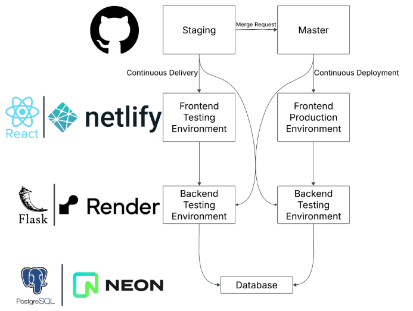
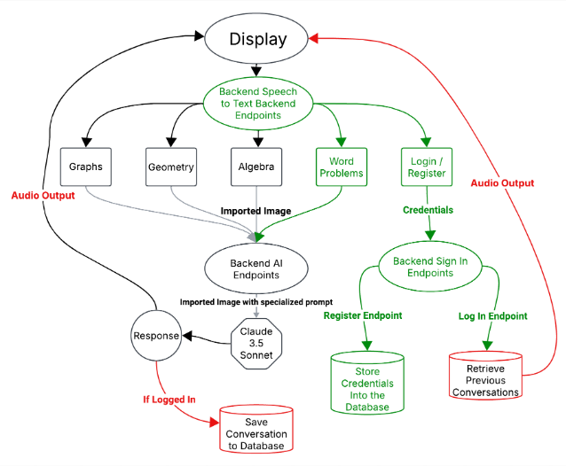

<div align="center">


</div>

# Mathster 

## Table of Contents

- [Purpose](#purpose)
  - [Features](#features)
- [Get Started](#get-started)
  - [Hosting Locally](#hosting-locally)
- [Documentation](#documentation)
  - [Diagrams](#diagrams)  
  - [Authors](#authors)

## Purpose

Mathster is a product designed for blind algebra/geometry students who face challenges with concepts such as graphs, shapes, and equations. Users can navigate the website with their voice and receive audio output as guidance and as feedback for their math questions.

### Features

Mathster provides text feedback as audio output for the following subjects: 
- Graphs
- Geometry
- Algebra


## Get Started

Mathster is built and deployed using [Render](https://render.com/) and [Netlify](https://netlify.com/). To host locally, the folder [tools](/tools) provides bash scripts that include the commands to be ran to host both the [backend](/backend) and [frontend](/frontend). The website should then be hosted on your [local host](https://localhost:5000).

### Hosting Locally

Once the repository has been cloned, the backend can be hosted locally in a terminal by running the commands:
```sh
$ cd ../backend
$ source env/Scripts/activate
$ pip install -r ./requirements.txt
$ Flask --app run run
```
In a new terminal, the frontend can be ran using the commands:
```sh
$ cd ../frontend
$ npm install
$ npm run dev
```

## Documentation

### Diagrams

|  |  |
|:--------------------------------:|:--------------------------------:|
|**Stack Overview**|**Use State Diagram**|


### Authors
- Brianna Jackson
- Connor Jonhson
- Julian Ondrey
- Stell Shuman-Thomas
- Tyler Snow
- Akeel Hanchard


